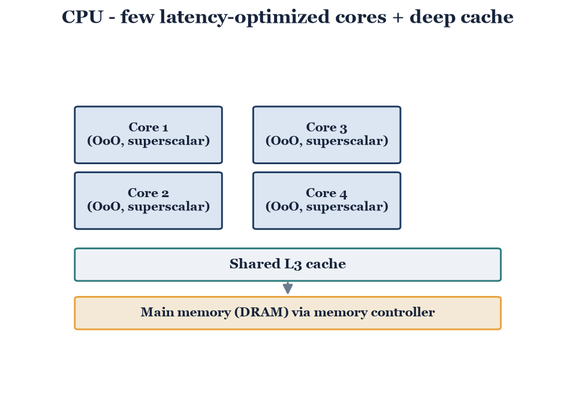
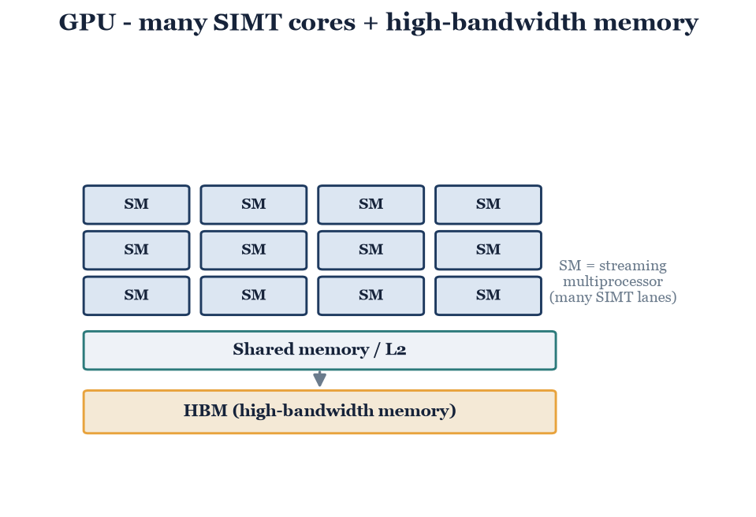
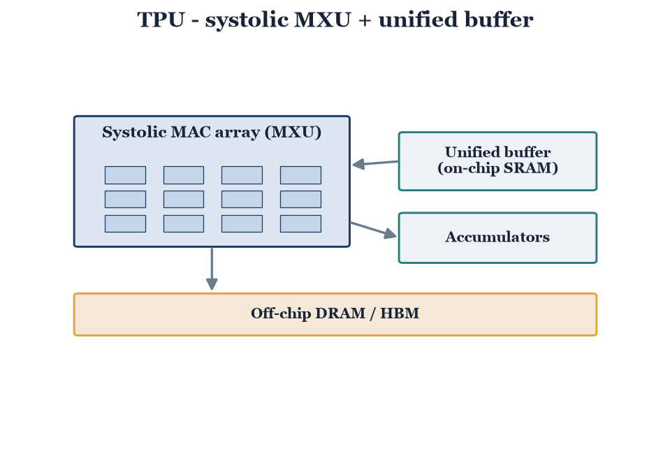
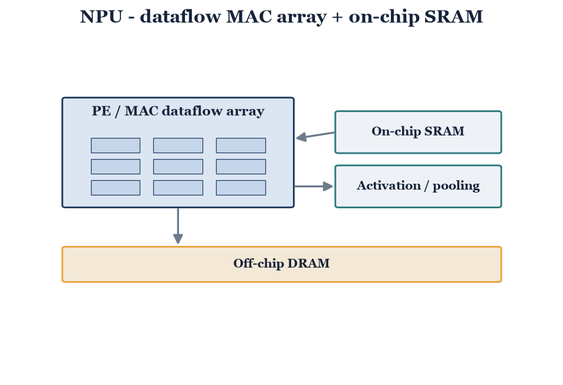

# Part 1 — Study of AI Hardware Accelerators

**Goal:** understand why specialized AI chips outperform CPUs for ML workloads,
and compare CPU / GPU / TPU / NPU across cores, memory, parallelism, power, and
AI performance — with a comparison table and architecture diagrams.

**Deliverables**

- [ ] Written argument for why accelerators beat CPUs on ML workloads
- [ ] Comparison table across the five metrics (see `data/accelerator_comparison.csv`)
- [ ] Four architecture diagrams (generated by `scripts/make_diagrams.py`)

---

## 1. Why specialized chips beat CPUs

*Write ~3 short paragraphs around these points:*

- **ML compute is dense linear algebra.** Inference and training are dominated by
  matrix multiplies — huge numbers of multiply-accumulate (MAC) operations that are
  highly regular and parallel.
- **CPUs are latency-optimized general cores.** They spend area on out-of-order
  logic, branch prediction, and large caches to make *single* threads fast, not on
  raw MAC throughput. Accelerators instead spend area on many MAC units, wide
  memory bandwidth, and reduced precision (INT8 / BF16).
- **The bottleneck is data movement, not arithmetic.** Moving a value from DRAM
  costs far more energy than the MAC itself — on the order of the ~200×
  DRAM-vs-compute penalty. Accelerators win by keeping data on-chip (SRAM buffers,
  systolic reuse) and minimizing movement. *(This is the same memory-wall argument
  that motivates the event-driven / in-memory angle in Thread A.)*

## 2. The four architectures

*One short subsection each. Stable, qualitative facts are pre-filled in
`data/accelerator_comparison.csv`; fill the `[TBD - cite]` power and performance
numbers from current datasheets / review papers.*

### CPU — few out-of-order superscalar cores, deep cache hierarchy

*Write 2–3 sentences: latency-optimized, control-heavy, general-purpose.*

### GPU — thousands of SIMT cores + HBM

*Write 2–3 sentences: massive data parallelism (SIMT), high memory bandwidth.*

### TPU — systolic MAC array (MXU) + unified on-chip buffer

*Write 2–3 sentences: systolic dataflow, weight reuse, datacenter ML.*

### NPU — MAC / dataflow array + on-chip SRAM (edge inference)

*Write 2–3 sentences: spatial dataflow, low power, edge/mobile inference.*

## 3. Comparison table

Render or paste from `data/accelerator_comparison.csv`:

| Metric | CPU | GPU | TPU | NPU |
|---|---|---|---|---|
| Core type & count | Few OoO superscalar cores | Thousands of SIMT cores | Systolic MAC array (MXU) | MAC / dataflow array |
| Memory architecture | L1/L2/L3 + DRAM | Shared mem / L2 + HBM | Unified buffer + HBM | On-chip SRAM + DRAM |
| Parallelism model | ILP / few threads (MIMD) | SIMT | Systolic dataflow | Spatial dataflow |
| Power (TDP) | *[cite]* | *[cite]* | *[cite]* | *[cite]* |
| AI performance (TOPS + precision) | *[cite]* | *[cite]* | *[cite]* | *[cite]* |
| Typical role | General-purpose | Training + inference | Datacenter ML | Edge inference |

## 4. Sources

*List datasheets / papers used for the power and performance figures.*
