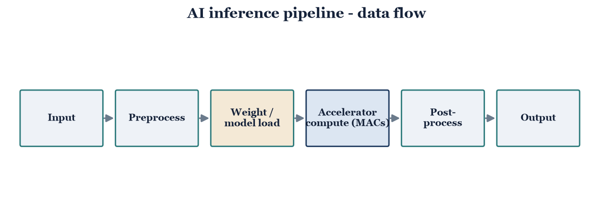
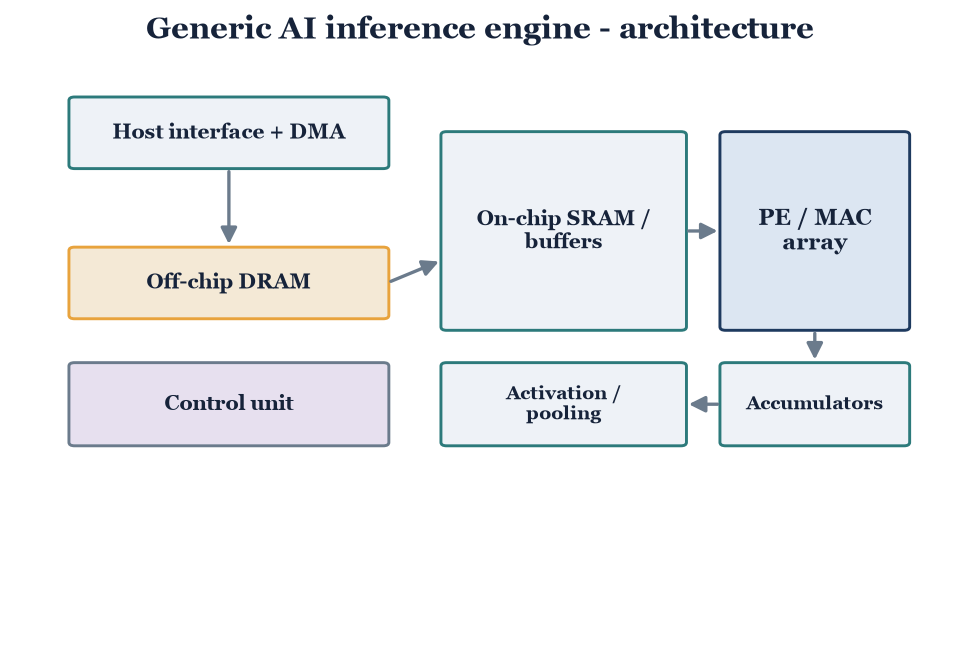

# Part 2 — AI Inference on Different Hardware

**Goal:** explain training vs inference, describe the complete inference pipeline
with a block diagram (how input data travels), and draw a generic AI inference
engine and explain how it works.

**Deliverables**

- [ ] Training-vs-inference comparison (table + short explanation)
- [ ] Inference-pipeline block diagram + data-flow walkthrough (`figures/part2_pipeline.png`)
- [ ] Generic inference-engine architecture + explanation (`figures/part2_inference_engine.png`)
- [ ] *(optional)* Measured CPU-vs-MPS inference numbers (`scripts/benchmark_inference.py`)

---

## 1. Training vs inference

| Aspect | Training | Inference |
|---|---|---|
| Purpose | Learn weights | Apply fixed weights to new inputs |
| Compute | Forward + backward pass | Forward pass only |
| Precision | FP32 / BF16 | INT8 / FP16 |
| Batching | Large batches | Small batches / single sample |
| Memory footprint | Weights + activations + gradients + optimizer state | Weights + activations only |
| Priority | Throughput | Latency (often) and/or throughput |

*Tie-in:* this project's surrogate-gradient SNN is exactly this split — trained
off-chip (GPU/MPS), then mapped once and read at inference. Thread A's baseline
already reports inference-side metrics (spikes/inference, synops/inference).

## 2. Inference pipeline

`Input → Preprocess → Weight / model load → Accelerator compute (MACs) →
Post-process → Output`

*Walk one input through:* raw input is normalized/shaped in preprocessing; weights
are staged from storage; the accelerator streams activations through its MAC units;
outputs are de-quantized / argmax'd in post-processing to a prediction.

## 3. Generic inference engine

Blocks: host interface + DMA, off-chip DRAM, on-chip SRAM / buffers, PE (MAC)
array, accumulators, activation / pooling units, control unit.

*Explain the working:* the host streams weights and inputs via DMA into DRAM;
the control unit stages tiles into on-chip SRAM; activations flow through the PE
array where MACs accumulate partial sums; accumulators finalize outputs, which
pass through activation/pooling and back to SRAM. Note where **data reuse**
(weight-stationary / output-stationary dataflow) cuts DRAM traffic — the same
data-movement cost that dominates energy in Part 1.

## 4. Measured note (optional)

If you run `scripts/benchmark_inference.py`, report the CPU-vs-MPS latency and
throughput here as a concrete example of "inference on different hardware." State
the model, batch size, and that TPU/NPU are literature-based (no local hardware).

## 5. Sources

*List references used.*
