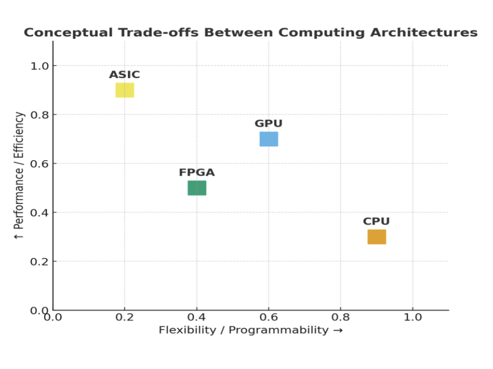
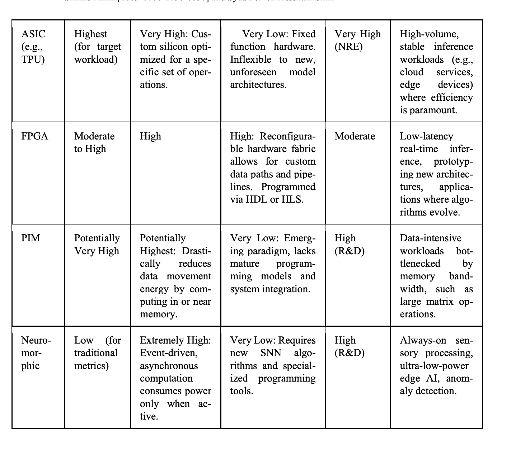

# Paper Notes Template

> Copy this file and rename it to the paper's short title, e.g. `sze2017_efficient_processing.md`

---

## Paper Info

- **Title:** The Role of Advanced Computer Architectures in Accelerating Artificial Intelligence Workloads
- **Authors:** Shahid Amin, Syed Pervez Hussnain Shah (Lahore Leads University)
- **Year:** 2025
- **Venue:** arXiv preprint (arXiv:2511.10010v1) 
- **Link:** https://arxiv.org/abs/2511.10010

---

## What Problem Does It Solve?

Modern AI models (DNNs, LLMs) have grown to billions/trillions of parameters, breaking the traditional Von Neumann architecture where the CPU-memory separation causes a data movement bottleneck. This paper synthesizes the current AI accelerator landscape — GPU, ASIC, FPGA, PIM, and neuromorphic — connecting core design principles to quantitative MLPerf v5.1 benchmark results

---

## Key Contribution

A structured comparative survey of dominant AI accelerator paradigms with a unified trade-off analysis (performance vs. efficiency vs. flexibility) and quantitative benchmarking data from MLPerf Inference v5.1. Key insight: hardware-software co-design is a core requirement for efficient AI systems.

---

## Architecture / Method (if applicable)

3 Models Mentioned:
- GPU: Thousands of cores for parallel matrix math; Tensor Cores for mixed-precision; NVLink for multi-chip scale-out. Best for research/training — flexible, runs any new model same day.
- ASIC: Fixed-function silicon hardwired for specific operators; largest on-chip SRAM, lowest energy per operation. Best for high-volume stable inference (cloud services, edge devices).
- FPGA: Reconfigurable hardware fabric via HLS tools; low-latency streaming pipelines for quantized networks. Best for prototyping and evolving algorithms.

Core design principles across all platforms:
- Dataflow optimization: Minimize data movement (orders of magnitude more costly than compute); strategies include Weight Stationary, Output Stationary, Row Stationary (Eyeriss).
- Memory hierarchy: HBM off-chip → on-chip global buffer → local PE register files; deeper hierarchy = fewer expensive DRAM accesses. 
- Sparsity & quantization: Skip zero-valued computations; use INT8 instead of FP32 to shrink model size and reduce memory bandwidth needs.

Emerging approaches:
- PIM (Processing-in-Memory): Compute inside or near memory to eliminate data movement entirely; limited by ADC/DAC overhead and lack of mature programming models.
- Neuromorphic : Event-driven, asynchronous — only fires when active. Energy efficient when workload is sparse; advantage disappears at high spike rates.

---

## Results

---

## How This Connects to My Project

- This paper maps directly to all 5 tasks in the UROP AI Accelerators project:
  - Tasks 1–2: GPU/ASIC/FPGA paradigms and why they exist (Von Neumann bottleneck, dataflow, memory hierarchy)
  - Task 3: Neuromorphic computing — when the energy advantage holds (sparse workloads) and when it fails (high spike rates)
  - Task 4: PIM as an emerging solution to data movement; limitation is ADC/DAC overhead
  - Task 5: Sparsity and quantization as key hardware-level optimizations

The co-design argument (hardware and software must be designed together) is directly actionable: any novel accelerator design idea for my project needs to account for the model's actual operator shapes and memory access patterns.

---

## What I'd Explore Further

- Roofline model: How do you mathematically determine whether a design is compute-bound vs. memory-bound? 
  - X-axis: arithmetic intensity (how many FLOPs you do per byte of memory you move)
  - Y-axis: performance (FLOPs/sec you actually achieve)

Two limits define the roof:

Compute ceiling — your chip's peak FLOPs/sec (horizontal line)
Memory bandwidth slope — performance = arithmetic intensity × memory bandwidth (diagonal line)

Where they intersect is the "ridge point." If your workload sits left of the ridge → memory-bound (you're waiting on data, not compute). Right of the ridge → compute-bound.
Eyeriss connection: RS dataflow exists specifically to push workloads to the right (higher arithmetic intensity) by reusing data in local registers instead of going back to DRAM every time.

---

## 2-Sentence Explanation

This 2025 survey maps the full AI accelerator landscape — from GPUs and ASICs to neuromorphic and in-memory computing — and benchmarks them against MLPerf v5.1 real-world data. The key takeaway: co-designing the model and hardware together (rather than independently) is now necessary to achieve high energy efficiency.
