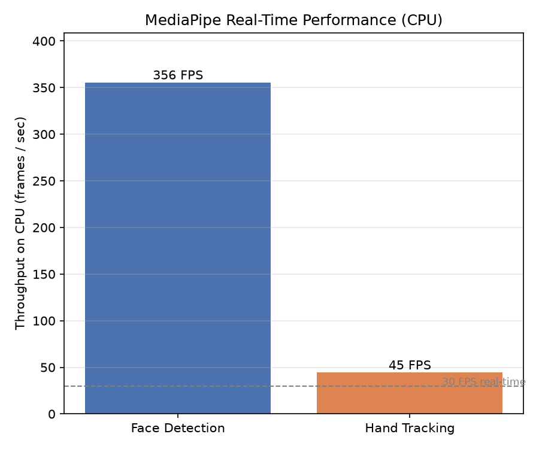

# MediaPipe Benchmarks — Face Detection & Hand Tracking (CPU)

Benchmarks two MediaPipe vision tasks to show that efficiency-optimized models reach
real-time performance on CPU alone — the on-device / edge counterpoint to the
GPU-hungry models benchmarked elsewhere in this project.

## Why CPU only

MediaPipe's Python package runs on CPU (no desktop CUDA path — its GPU acceleration
exists only in mobile builds). So there is no GPU column here; the point of these
benchmarks is how fast a purpose-built lightweight model runs *without* an accelerator.

Note: current MediaPipe removed the legacy `mp.solutions` API, so this uses the
Tasks API (`mediapipe.tasks.python.vision`). Model bundles download automatically
on first run.

## What it measures

A synthetic 640x480 frame is processed (100 iterations after warmup):

- **Face Detection** — BlazeFace short-range detector
- **Hand Tracking** — Hand Landmarker (up to 2 hands)

Logged per run: latency (ms) and throughput (FPS).

## How to run

Install once: `pip install mediapipe`. (Requires Python <= 3.12; run on Colab if your
local Python is newer.)

```bash
python run.py --task face_detection
python run.py --task hand_gesture
```

Generate the figure from `benchmarks/`:

```bash
python plot_mediapipe.py --csv face_detection/results.csv hand_gesture/results.csv --out ../../../results/figures
```

## Results (CPU)

| Task            | Latency | FPS   | vs 30 FPS real-time |
|-----------------|---------|-------|---------------------|
| Face Detection  | 2.5 ms  | 398   | 13x headroom        |
| Hand Tracking   | 16.1 ms | 62    | 2x headroom         |

*(Measured on Colab CPU, since local Python 3.14 is not yet supported by MediaPipe.)*



## Takeaway

Both tasks run well above real time on a CPU with no GPU. MediaPipe achieves this with
small, hardware-friendly models (quantized TFLite, optimized via the XNNPACK CPU
delegate) purpose-built for on-device use. This is the flip side of the accelerator
story: not every workload needs a GPU — when a model is designed for efficiency, a CPU
is enough for real-time inference. It motivates dedicated low-power edge accelerators
(NPUs) rather than raw GPU horsepower for this class of task.
