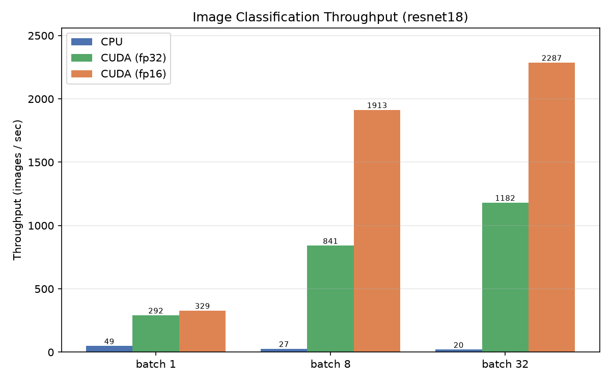

# Image Classification Benchmark

Benchmarks inference of a pretrained CNN (ResNet18 / MobileNetV2) across hardware,
precision, and batch size to show how AI accelerators scale with parallel workload.

## What it measures

For each batch size, the forward pass is timed (50 iterations after warmup) on:

- **CPU** (FP32)
- **GPU** (FP32) — CUDA
- **GPU** (FP16) — CUDA, low-precision / tensor-core path

Logged per run: latency (ms), throughput (images/sec), and GPU power draw (W).
Input is a random 224x224 image tensor — timing does not depend on image content.

## How to run

CPU runs go on the local machine; GPU runs go on Google Colab (GPU runtime).

```bash
# CPU
python run.py --device cpu --model resnet18 --batch 1 8 32

# GPU (Colab)
python run.py --device cuda --dtype fp32 --model resnet18 --batch 1 8 32
python run.py --device cuda --dtype fp16 --model resnet18 --batch 1 8 32
```

Results append to `results.csv`. Generate the figure from `benchmarks/`:

```bash
python plot_image_classification.py --csv image_classification/results.csv --out ../../../results/figures
```

## Results (ResNet18, throughput in images/sec)

| Batch | CPU  | GPU FP32 | GPU FP16 |
|-------|------|----------|----------|
| 1     | 84   | 330 (3.9x)  | 340 (4.0x)  |
| 8     | 58   | 910 (15.6x) | 1807 (31.0x)|
| 32    | 26   | 1271 (48.4x)| 2478 (94.3x)|

*(Speedups are relative to CPU at the same batch. Measured on a free-tier Colab GPU.)*



## Accuracy

Accuracy is determined by the (identical) pretrained weights, so it is the same on
CPU and GPU-FP32. FP16 can differ by a negligible margin from rounding. The hardware
choice affects speed and energy, not correctness.

## Takeaway

CPU throughput *falls* as batch size grows (it cannot parallelize the extra images and
becomes memory-bound), while GPU throughput *rises* sharply. FP16 widens the gap
further via tensor cores. At batch 32 the GPU delivers up to ~94x the CPU throughput —
a direct demonstration of why parallel AI accelerators dominate inference workloads.
