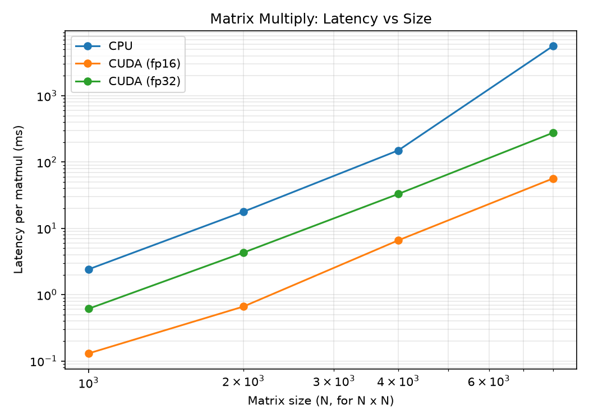
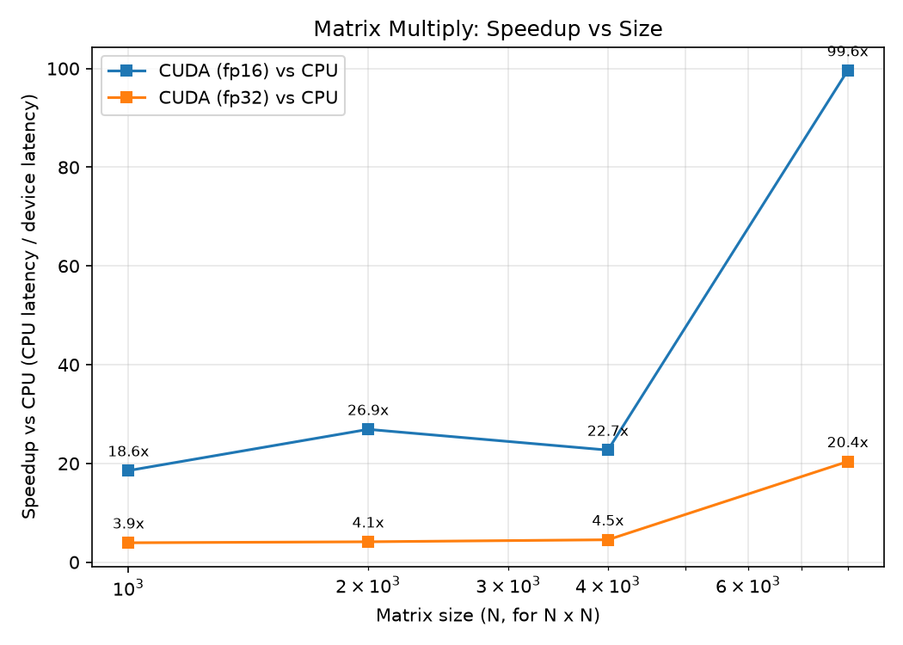

# Matrix Multiply Benchmark

Benchmarks a dense `N x N` matrix multiply across hardware and precision to show
why AI accelerators outperform CPUs on the core operation behind neural networks.

## What it measures

For each matrix size, one `torch.matmul` is timed (50 iterations after warmup) on:

- **CPU** (FP32)
- **GPU** (FP32) — CUDA
- **GPU** (FP16) — CUDA, low-precision path that uses tensor cores

Logged per run: latency (ms), throughput (inferences/sec), and GPU power draw (W).

## How to run

CPU runs go on the local machine; GPU runs go on Google Colab (GPU runtime).

```bash
# CPU sweep
python run.py --device cpu  --size 1000 2000 4000 8000

# GPU sweeps (Colab)
python run.py --device cuda --dtype fp32 --size 1000 2000 4000 8000
python run.py --device cuda --dtype fp16 --size 1000 2000 4000 8000
```

Results append to `results.csv`. Generate the figures from `benchmarks/`:

```bash
python plot_matrix_mult.py --csv matrix_mult/results.csv --out ../../../results/figures
```

## Results

GPU speedup over the CPU baseline, by matrix size:

| Size      | GPU FP32 | GPU FP16 |
|-----------|----------|----------|
| 1000x1000 | 4.1x     | 11.8x    |
| 2000x2000 | 4.2x     | 17.4x    |
| 4000x4000 | 5.1x     | 28.3x    |
| 8000x8000 | 5.8x     | 29.9x    |

*(Measured on a free-tier Colab GPU; exact numbers vary by hardware.)*




## Takeaway

The GPU advantage **grows with problem size** — small matrices don't give the GPU
enough parallel work to hide its launch overhead, so the gap widens as the matrices
get larger. Dropping to **FP16** widens it much further (up to ~30x), because
low-precision arithmetic runs on the GPU's tensor cores. This is the fundamental
reason AI accelerators beat CPUs: massively parallel, low-precision matrix math.
