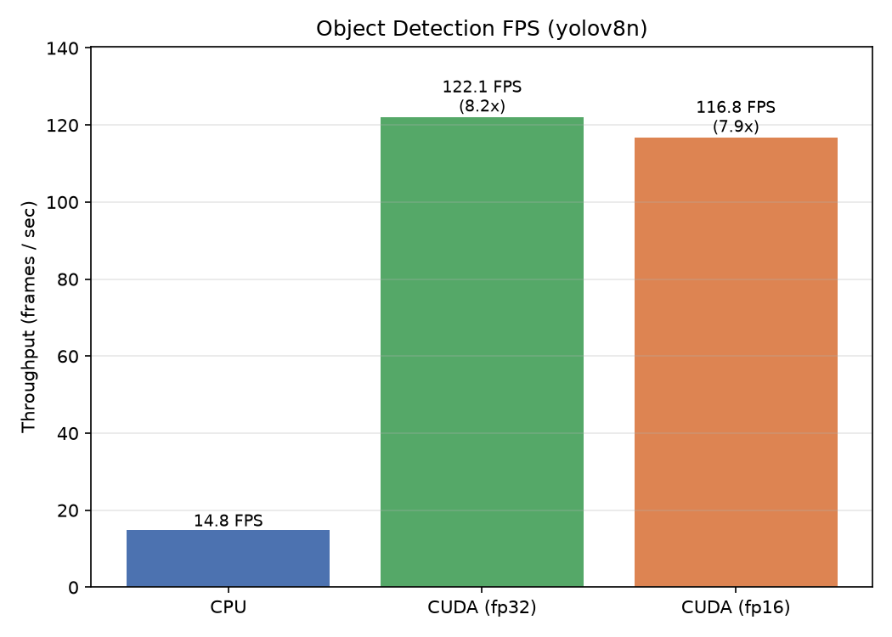

# Object Detection Benchmark

Benchmarks real-time object detection (YOLOv8n via ultralytics) across CPU and GPU
to measure the frames-per-second gain from AI acceleration.

## What it measures

A single 640x640 frame is run through YOLOv8n (50 iterations after warmup) on:

- **CPU** (FP32)
- **GPU** (FP32) — CUDA
- **GPU** (FP16) — CUDA

Logged per run: latency (ms), throughput (FPS), and GPU power draw (W).
Input is a fixed synthetic frame so timing does not depend on disk or image content.

## How to run

Install once: `pip install ultralytics` (weights auto-download on first run).

```bash
# CPU (local)
python run.py --device cpu

# GPU (Colab)
python run.py --device cuda --dtype fp32
python run.py --device cuda --dtype fp16
```

Results append to `results.csv`. Generate the figure from `benchmarks/`:

```bash
python plot_object_detection.py --csv object_detection/results.csv --out ../../../results/figures
```

## Results (YOLOv8n)

| Device        | FPS   | Speedup vs CPU |
|---------------|-------|----------------|
| CPU (FP32)    | 18.5  | 1.0x           |
| GPU (FP32)    | 121.6 | 6.6x           |
| GPU (FP16)    | 123.4 | 6.7x           |



## Takeaway

The GPU lifts detection from ~18 FPS (below smooth real-time) to ~122 FPS, a 6.6x
speedup that comfortably clears the 30 FPS real-time bar. Unlike image classification,
**FP16 gives almost no additional gain here** — YOLOv8n is a small model whose runtime
is dominated by non-matrix postprocessing (non-max suppression), so lower-precision
arithmetic has little to accelerate. This illustrates that the benefit of AI hardware
depends on the workload: compute-bound models gain the most from precision reduction.
