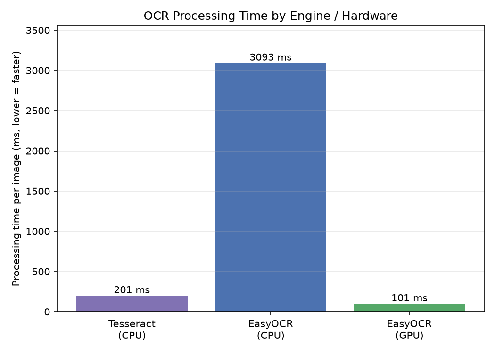

# OCR Benchmark — Tesseract vs EasyOCR

Compares text-recognition processing time across a classical engine (Tesseract) and a
deep-learning engine (EasyOCR) on CPU and GPU.

## What it measures

A fixed text image (four printed lines) is recognized (10 iterations after warmup) by:

- **Tesseract** (CPU) — classical, non-neural OCR engine
- **EasyOCR** (CPU) — deep-learning OCR (PyTorch)
- **EasyOCR** (GPU) — same model, CUDA-accelerated

Logged per run: latency (ms), throughput (images/sec), GPU power draw (W).
(PaddleOCR from the original task list was omitted — its install is heavy and
frequently breaks; noted as a limitation.)

## How to run

```bash
# Colab (recommended — installs cleanly)
apt-get install -y tesseract-ocr
pip install pytesseract easyocr

python run.py --engine tesseract --device cpu
python run.py --engine easyocr  --device cpu
python run.py --engine easyocr  --device cuda
```

Generate the figure from `benchmarks/`:

```bash
python plot_ocr.py --csv ocr/results.csv --out ../../../results/figures
```

## Results

| Engine / Hardware  | Latency  | vs Tesseract-CPU |
|--------------------|----------|------------------|
| Tesseract (CPU)    | 279 ms   | 1.0x             |
| EasyOCR (CPU)      | 2975 ms  | 10.7x slower     |
| EasyOCR (GPU)      | 102 ms   | 2.7x faster      |

EasyOCR GPU vs EasyOCR CPU: **29x faster**.



## Takeaway

On CPU, the **classical Tesseract engine is ~10x faster** than the deep-learning
EasyOCR — a neural model is overkill and slow without acceleration. But moving EasyOCR
to the GPU makes it **29x faster than itself** and the quickest option overall. The
lesson mirrors the whole project: deep-learning models only pay off when paired with the
right hardware; on a bare CPU, a lightweight classical algorithm can win.
