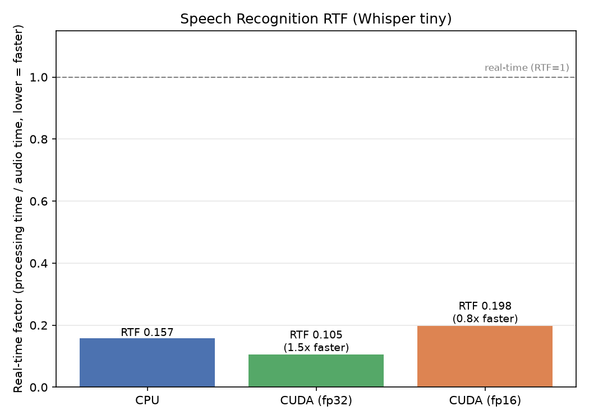

# Speech Recognition Benchmark

Benchmarks speech-to-text (OpenAI Whisper Tiny) across CPU and GPU, measured by
real-time factor (RTF = processing time / audio length; RTF < 1 = faster than real time).

## What it measures

A fixed 15-second synthetic 16 kHz audio clip is transcribed (5 iterations after
warmup) on:

- **CPU** (FP32)
- **GPU** (FP32) — CUDA
- **GPU** (FP16) — CUDA

Logged per run: latency (ms), RTF, throughput (clips/sec), and GPU power draw (W).

## How to run

Install once: `pip install openai-whisper`.

```bash
# CPU (local)
python run.py --device cpu

# GPU (Colab)
python run.py --device cuda --dtype fp32
python run.py --device cuda --dtype fp16
```

Results append to `results.csv`. Generate the figure from `benchmarks/`:

```bash
python plot_speech_recognition.py --csv speech_recognition/results.csv --out ../../../results/figures
```

## Results (Whisper Tiny, 15s clip)

| Device      | RTF   | Speedup vs CPU |
|-------------|-------|----------------|
| CPU (FP32)  | 0.116 | 1.0x           |
| GPU (FP32)  | 0.093 | 1.2x           |
| GPU (FP16)  | 0.107 | 1.1x           |

*(RTF ~0.1 means ~9x faster than real time on every device. Free-tier Colab GPU.)*



## Takeaway

Unlike the vision benchmarks, the GPU offers only a **~1.2x** edge here, and FP16 is
actually slightly slower than FP32. Two reasons: Whisper Tiny is a small model, and its
decoder is **autoregressive** — it generates text one token at a time, where each step
depends on the previous one. Sequential dependencies cannot be parallelized, so the
GPU's many cores sit idle, and much of the runtime is CPU-side Python decoding. The
lesson: AI accelerators help most with large, parallel, compute-bound workloads; small
sequential models see little benefit. (Note: even the CPU runs ~9x faster than real
time, so all three are perfectly usable for live transcription.)
